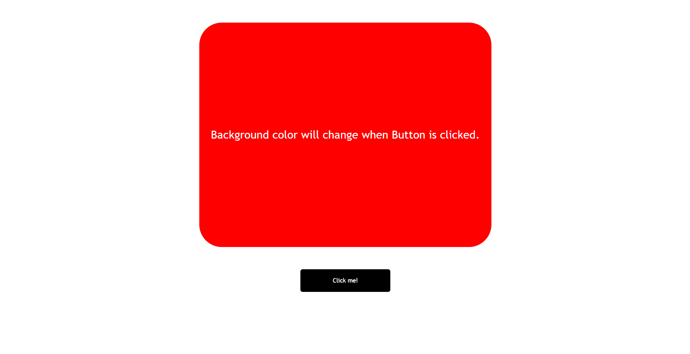
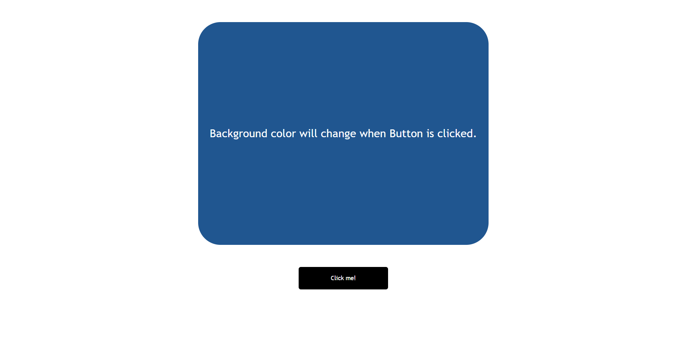

# Color Changer
---

> Screen-Shot of the project.

#

## Built-with
---

This project is created using:

 1. HTML
 2. CSS
 3. Javascript

#

## Live Project
---

This project is hosted on Netlify.

[Netlify](https://shobhits-fsjs-project-ColorChanger.netlify.app/)

#

## About
---

Name: **Shobhit Sheta**

  